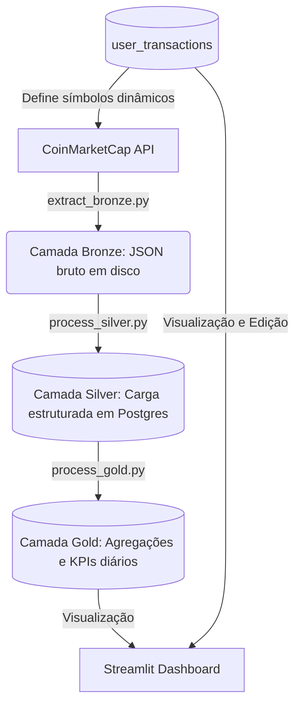

# 📊 Crypto Data Engineer Portfolio & ETL Pipeline

Este projeto é uma solução prática de Engenharia de Dados e Visualização para gestão de portfólio de criptoativos. Ele implementa um pipeline ETL completo seguindo a **Arquitetura Medalhão (Bronze, Silver e Gold)** para extrair cotações de criptomoedas, estruturá-las em um Data Warehouse (PostgreSQL) e fornecer métricas consolidadas e interativas por meio de um dashboard em **Streamlit**.

---

## 🛠️ Arquitetura do Pipeline de Dados (Medalhão)

A organização dos dados segue o padrão Medalhão para garantir a rastreabilidade, limpeza e agregação adequada das informações:



1. **Bronze (Raw/Bruto)**: 
   - Arquivo: [`app/extract_bronze.py`](file:///d:/Projetos_Portfolio/crypto_data_engineer/app/extract_bronze.py)
   - Extrai cotações em tempo real da API do **CoinMarketCap**.
   - Identifica dinamicamente quais ativos monitorar buscando na tabela de transações do usuário (`user_transactions`). Se estiver vazia, utiliza uma lista padrão (`BTC`, `ETH`, `LINK`, `XRP`, `SOL`).
   - Salva a resposta da API como arquivos JSON brutos em `data/bronze/cmc_quotes_{timestamp}.json`.

2. **Silver (Trusted/Estruturado)**:
   - Arquivo: [`app/process_silver.py`](file:///d:/Projetos_Portfolio/crypto_data_engineer/app/process_silver.py)
   - Consome o arquivo JSON gerado mais recentemente pela Bronze.
   - Trata, limpa e estrutura os dados em um DataFrame Pandas.
   - Insere (append) os registros estruturados na tabela `silver_crypto_prices` dentro do PostgreSQL.

3. **Gold (Curated/Agregado)**:
   - Arquivo: [`app/process_gold.py`](file:///d:/Projetos_Portfolio/crypto_data_engineer/app/process_gold.py)
   - Lê os dados históricos da tabela `silver_crypto_prices`.
   - Realiza transformações analíticas agregando os dados por data e símbolo da moeda para calcular:
     - Preço mínimo (`price_min`)
     - Preço máximo (`price_max`)
     - Preço médio (`price_avg`)
     - Número de registros (`record_count`)
     - Volatilidade diária percentual (`volatility_pct`)
   - Atualiza a tabela `gold_daily_summary` no banco de dados.

4. **Orquestrador**:
   - Arquivo: [`app/pipeline.py`](file:///d:/Projetos_Portfolio/crypto_data_engineer/app/pipeline.py)
   - Centraliza e executa sequencialmente o fluxo inteiro: **Bronze ➡️ Silver ➡️ Gold**.
   - Pode rodar uma única vez ou em um loop contínuo (ex: a cada 30 minutos).

---

## 💻 Streamlit Dashboard (Visualização & Operações)

Localizado em [`app/app.py`](file:///d:/Projetos_Portfolio/crypto_data_engineer/app/app.py), o dashboard fornece uma interface interativa dividida em duas abas:

1. **Dashboard Geral**:
   - **Fluxo de Caixa (Histórico)**: Métricas consolidadas de *Total Aportado*, *Total Vendido/Sacado* e *Capital Líquido Alocado*.
   - **Performance da Carteira (Holdings)**: Patrimônio atualizado a mercado, Custo médio ajustado (Cost Basis) da posição e Lucro/Prejuízo Aberto (Unrealized PnL em $ e %).
   - **Detalhamento por Ativo**: Tabela interativa com formatações condicionais (gradientes de cor para ganhos/perdas).

2. **Registrar Operação & Histórico**:
   - Formulário para registrar compras e vendas de criptoativos (Símbolo, Quantidade, Preço Unitário em USD e Data).
   - Tabela editável (`st.data_editor`) que permite a edição direta de registros salvos ou remoção de transações incorretas, sincronizando em tempo real com o banco de dados.

---

## 📂 Estrutura do Diretório

```text
crypto_data_engineer/
├── .venv/                  # Ambiente virtual Python (gerado localmente)
├── app/
│   ├── app.py              # Aplicação frontend Streamlit
│   ├── extract_bronze.py   # Script de extração da API (Bronze)
│   ├── pipeline.py         # Orquestrador do pipeline de dados
│   ├── process_gold.py     # Script de agregações e KPIs (Gold)
│   ├── process_silver.py   # Script de modelagem e carga (Silver)
│   └── teste_conexao.py    # Script utilitário para validar acesso ao banco
├── data/
│   └── bronze/             # Destino local dos arquivos JSON extraídos (ignorado pelo Git)
├── Dockerfile              # Dockerfile para o container de ETL
├── docker-compose.yaml     # Infraestrutura: PostgreSQL, pgAdmin e ETL
├── pyproject.toml          # Configurações do projeto uv/pip
├── requirements.txt        # Dependências Python do projeto
└── .env.example            # Exemplo de variáveis de ambiente
```

---

## 🚀 Como Executar o Projeto

### 1. Pré-requisitos
Antes de começar, certifique-se de ter instalado em sua máquina:
- **Git**
- **Docker Desktop for Windows** instalado e com a integração WSL habilitada. No Docker Desktop, vá em **Settings/Configurations** → **Resources** → **WSL integration**; marque **Enable integration with my default WSL distro** e, se aplicável, também **Enable integration with additional distros** e selecione **ubuntu**.
- **Docker** e **Docker Compose**
- **Python 3.9+** (ou o gerenciador **uv**)

---

### 2. Configurando o Ambiente
1. Clone o repositório para sua máquina local.
2. Crie o arquivo `.env` a partir do modelo `.env.example`:
   ```bash
   cp .env.example .env
   ```
3. Abra o arquivo `.env` e configure sua chave de API do CoinMarketCap:
   ```env
   CMC_API_KEY=seu_token_aqui
   ```
   *(Obtenha uma chave gratuita em [CoinMarketCap API](https://pro.coinmarketcap.com/))*

---

### 3. Subindo a Infraestrutura com Docker
No diretório raiz do projeto, execute o comando abaixo para iniciar o banco de dados PostgreSQL e o pgAdmin:

```bash
docker compose up -d postgres pgadmin
```

- **PostgreSQL**: Estará disponível em `localhost:5432`
  - *Database*: `crypto_db`
  - *Usuário*: `admin`
  - *Senha*: `admin_password`
- **pgAdmin**: Painel de gerenciamento visual acessível em `http://localhost:5050`
  - *E-mail*: `admin@admin.com`
  - *Senha*: `admin`

---

### 4. Configurando o Ambiente Virtual Python
Você pode configurar o ambiente virtual de duas formas (usando `uv` ou `pip` tradicional).

#### Opção A: Usando `uv` (Recomendado/Mais rápido)
```bash
# Caso não tenha criado o ambiente virtual ainda
uv venv

# Ative o ambiente virtual
# No Windows (PowerShell):
.venv\Scripts\activate
# No Linux/Mac:
source .venv/bin/activate

# Instale as dependências a partir do pyproject.toml
uv sync
```

#### Opção B: Usando `pip` Padrão
```bash
# Criar o ambiente virtual
python -m venv .venv

# Ative o ambiente virtual
# No Windows (PowerShell):
.venv\Scripts\activate
# No Linux/Mac:
source .venv/bin/activate

# Instale as dependências
pip install -r requirements.txt
```

---

### 5. Executando o Pipeline de Dados (ETL)

Com o banco de dados rodando e as dependências instaladas, você deve rodar o pipeline para extrair e processar os dados iniciais.

#### Execução Local (Recomendada para Desenvolvimento)
Garanta que seu `.env` possui `DB_CONNECTION_URI` apontando para `localhost` e execute:
```bash
python app/pipeline.py
```

#### Execução via Docker (Opcional)
Se preferir rodar o pipeline dentro do container Docker configurado no `docker-compose.yaml`:
```bash
# Iniciar o container da aplicação ETL
docker compose up -d etl_app

# Executar o script do pipeline dentro dele
docker compose exec etl_app python app/pipeline.py
```

---

### 6. Inicializando o Dashboard Streamlit
Por fim, inicie o servidor do Streamlit para visualizar a interface gráfica e começar a gerenciar suas transações:

```bash
streamlit run app/app.py
```

O dashboard será aberto automaticamente no seu navegador padrão no endereço `http://localhost:8501`.

---

## 🔍 Verificando os Resultados no Banco de Dados
Caso deseje auditar as tabelas criadas:
1. Acesse o **pgAdmin** em `http://localhost:5050` e faça login.
2. Registre um novo servidor conectando no host `postgres` (se dentro da rede docker) ou `localhost` (se fora), porta `5432`, banco `crypto_db`, usuário `admin` e senha `admin_password`.
3. Verifique as tabelas criadas no schema `public`:
   - `user_transactions`: Histórico das suas movimentações financeiras.
   - `silver_crypto_prices`: Histórico de cotações brutas limpas da API.
   - `gold_daily_summary`: KPIs consolidados e resumos diários para análise.
